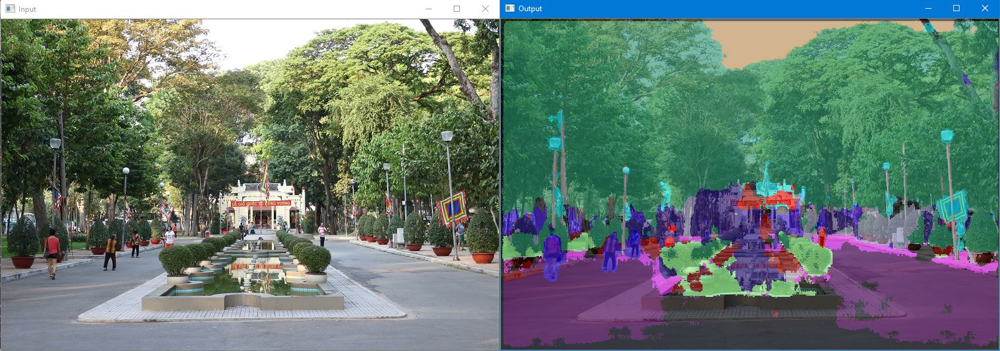

# Source code sample về DNN (Deep Neural Network) của thư viện OpenCV.
- Build bằng Visual Studio 2015 trở lên

## Nếu có lỗi trong quá trình build liên hệ: Võ Hùng Vĩ

https://thigiacmaytinh.com

https://www.facebook.com/groups/thigiacmaytinh